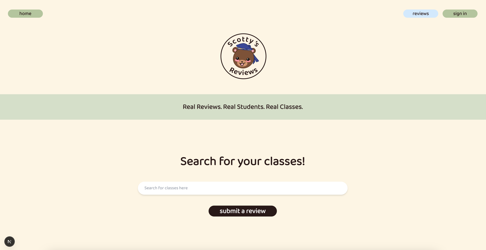
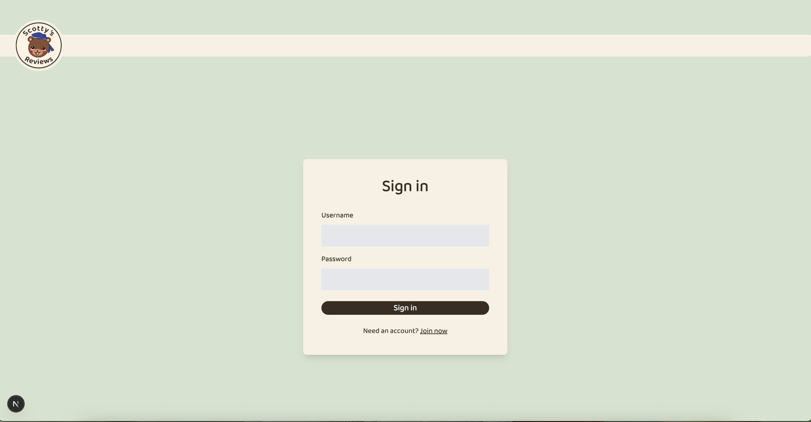
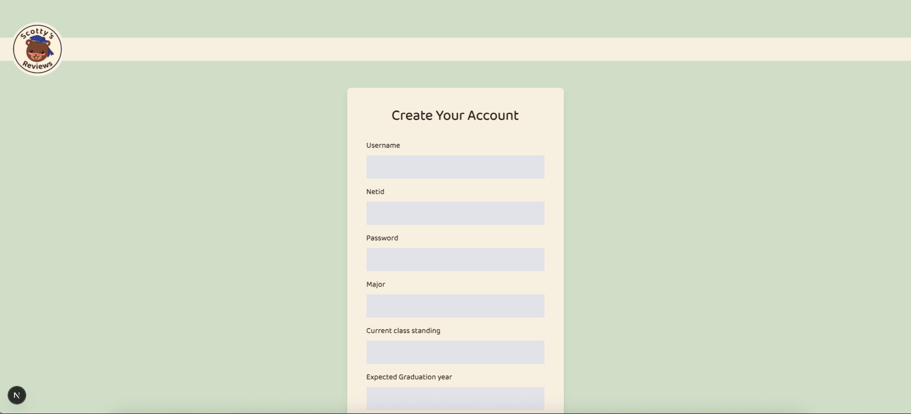
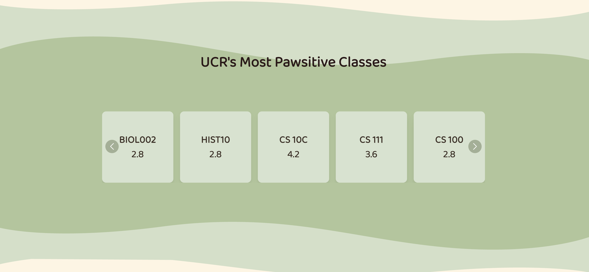
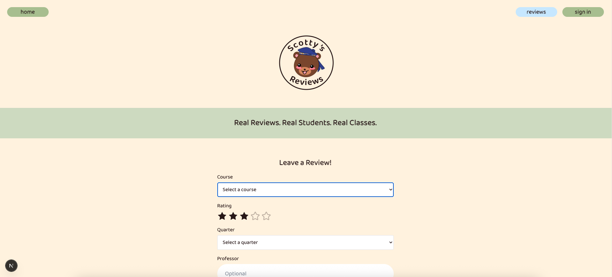
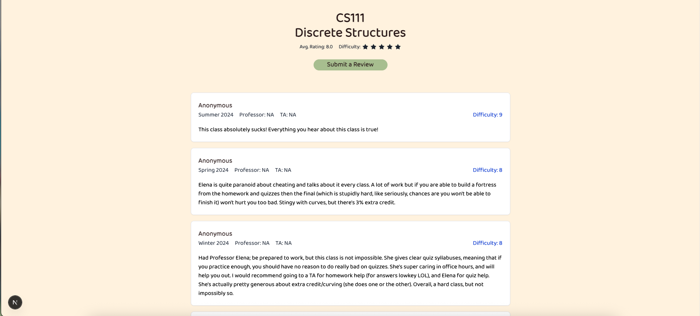
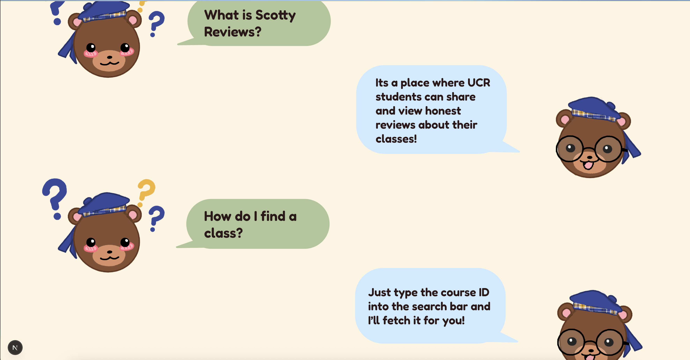
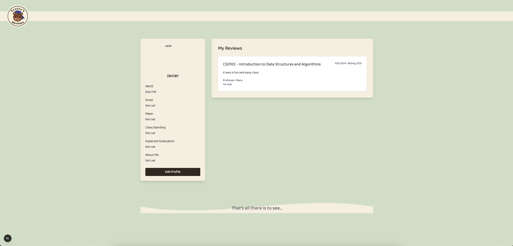

# 📚 UCR Course Review App

A full-stack web app for UCR students to explore, rate, and review courses — built with **Next.js 14 (App Router)**, **PostgreSQL**, **Prisma**, **Tailwind CSS**, and **Docker**.

---

## 🚀 Tech Stack

- **Frontend**: Next.js 14 (App Router), TypeScript, Tailwind CSS, Shadcn UI
- **Backend**: Next.js API routes, Prisma ORM
- **Auth**: Auth.js (NextAuth) using email/password + Prisma Adapter
- **Database**: PostgreSQL (via Docker)
- **Runtime**: Docker Compose (for app + DB)
- **Designs**: Figma

---

## Before Getting started

Make sure you have the following installed before running docker commands

- Docker Desktop
    - Instructions for installation
        - https://docs.docker.com/desktop/ 

- IDE or Terminal for running commands:
    - VS Code IDE
        - https://code.visualstudio.com/ 

- Git support for cloning repositories
    - Latest git versions
        - https://git-scm.com/ 

## 🧑‍💻 Getting Started (For Developers)

### 1. Clone the Repository
```bash
git clone https://github.com/101010zyl/ucrreview.git

# This path may vary for you. CD into the folder that has the cloned repo first then run this command below
# For example, if I save the repo to Downloads, do "cd Downloads" first
cd ucrreview
```

### 2. Start services
```bash
docker-compose up --build -d # Builds everything you need to run website locally
```

### 3. Open the app in your browser
```bash
http://localhost:3000 # Link to use to access website on local machine
```

### 4. Stop services
```bash
docker-compose down # shuts down the docker container, deletes the container, and returns to blank state
```

### 5. Check the logs (if generating fails)
```bash
docker-compose logs -f
docker-compose logs -f app # for app logs
docker-compose logs -f db # for db logs
```

### 6. Database and Docker seeding fail (port 5432 is already in use)
```bash
# This is for if your database gets an error of ports in use
# Make sure to delete all docker containers creating from previous seeding
# Also, stop all other databases (MySQL, Firebase, etc) that use the same port
# This will kill all services using 5432 port so that it's free for generating Docker build clean

# For Mac/Linux
sudo lsof -i :5432 # Shows all services using specified port
sudo pkill -u postgres # Kills postgres services using port 5432 (Change postgres to other services using the port if applicable)

# For Windows
netstat -ano | findstr :5432 # Shows all processes along with it's specific PID at the end to the right for each process
taskkill /PID 1234 /F # Replace 1234 with PID shown for you. Do this for each individual one shown until all are gone. Run first command again to make sure all processes are gone

# Once these processes are killed, try to run the docker again with docker-compose up --build
```

## How it all works

Frontend:
- We used a fairly simple techstack with Next.js APP Router that was able to generate all webpages for each class accordingly instead of generating one for each class
- We also used Figma to be able to layout how each page would look like and Tailwind CSS for styling it to the app
- We lastly used Shadcn UI in order to link the button styling from Tailwind CSS to a function on the homepage

Backend:
- We used Next.js API routres that integrated with Prisma ORM to be able to connect the frontend user requests to the database
- We also used an AUTH system handled by NextAuth with CredentialsProvider in order to take input from the user and create an account while storing a hashed password for user privacy
- We lastly used session data that is managed by JWT with custom fields for user metadata

Database:
- We used a PostgreSQL schema managed via Prisma and seeded with a seed.ts file that stored all old UCR course reviews from a cleaned csv and all classes in the UCR Catalog
- We also created a separate User table in the Database in order to store all users created along with their information they inputted and hashed password
- We lastly used Docker, Docker-Compose, and a start.sh file to geenerate the database in Dockerfile, call start.sh in docker-compose, and migrate all information from seed.ts to the database while also displaying the website link for the user's local machine

Runtime:
- We used Docker Containers to run a virtual app that creates a prefilled database, website, and app for the user to use on their machine with the use of a single command. 

## App Screenshots

Home Page:

- This is where you can search for a class, got to sign in to your account, and got to view reviews using their respecttive buttons

Login Page:

- This is where you can sign in or create an account

Account Creation:

- This is where you can create an account with all your information

Popular Classes:

- This is where you can view the most requested classes and popular classes that students want to read about

Submit Review: 

- This is where you can submit reviews

Class Review:

- This is an example of the many individual pages someone can view on a specific class

Scotty Advice:

- This is where Scotty gives you a couple tips on what the website is and how to use it

Profile Page:

- This is where you can view your profile and customize it to personally fit you

## Contributor Credits
- Javier Herrrera Jr (jherr116):
    - Created a fully seeded database with old reviews from a spreadsheet and classes from the UCR Catalog
    - Fixed Authentication and password hashing that stores in the database for privacy purposes
    - Worked on having user accounts that are created to properly store in the database and be retrieved at anytime
    - Edited README structure
    - Helped in any other part of the project that needed assistance or testing on certain features
    
- Benjamin Lim (blim038):
    - 
    
- Ashely Han (ahan045):
    - 

- Peihan Liu (pliu101):
    - 

- Yilin Zhu (yzhu305):
    - 